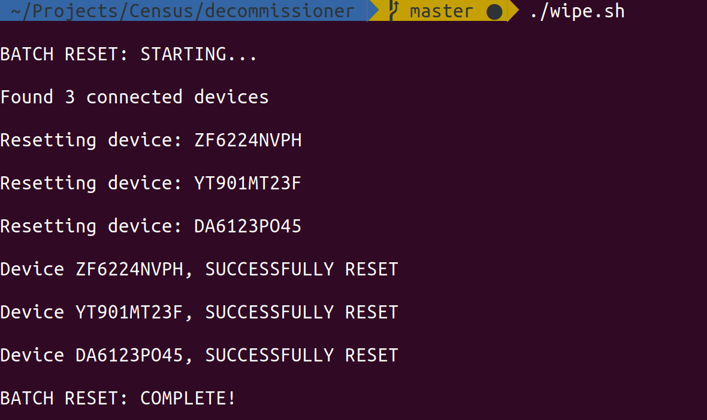

# Skrip Bash untuk mereset (melalui Termux & ADB ) perangkat Android (Pie)
## DOWNLOAD TERMUX FDROID
*Unduh & Install Termux [`Klik Disini`](https://f-droid.org/repo/com.termux_118.apk)*
## DOWNLOAD TERMUX API
*Unduh & install [`klik Disinj`](https://f-droid.org/repo/com.termux.api_49.apk)*
## Perangkat Keras
* Perangkat yang menjalankan Android 9, terhubung ke komputer Anda melalui USB
* Komputer yang menjalankan Ubuntu dan memiliki setidaknya satu port USB
* Hub USB (untuk mencolokkan beberapa perangkat sekaligus)

## Perangkat Lunak
* Komputer harus menjalankan sistem operasi Linux yang dapat mengeksekusi skrip bash. Secara teori, Anda dapat menggunakannya di Windows melalui aplikasi seperti [Git Bash](https://git-scm.com/downloads). Komputer harus memiliki aplikasi berikut yang terinstal dan berfungsi:
* sqlite3
* adb
* Termux & Termux API

## Lingkungan
* USB debugging perlu diaktifkan pada perangkat yang akan direset. ([Cara](https://developer.android.com/studio/debug/dev-options))
# Install via Termux
```bash
pkg update && pkg upgrade``` 
```bash
pkg install git
```
```bash
pkg install bash
```
```bash
git clone https://github.com/WilDev26/Factory-Android-9
```
```bash 
cd Factory-Android-9
```
# JIKA SUDAH TER-INSTALL IZINKAN
```bash
chmod +× wipe.sh
```
# LALU JALANKAN
```bash
./wipe.sh
```
# Memulai
## Menyiapkan via sqlite3
* Instal semua aplikasi yang diperlukan di komputer
```
sudo apt install -y sqlite3 android-tools-adb
```

* Kloning repositori menggunakan git:
```
git clone https://github.com/WilDev26/Factory-Android-9
cd Factory-Android-9
```

# Penggunaan
## Persiapan
1. Hubungkan hub USB ke komputer, lalu colokkan setiap perangkat Android ke hub USB. 2. Aktifkan USB debugging pada setiap perangkat android

## Menjalankan
Jalankan perintah berikut saat berada di direktori decommissioner.
```
./wipe.sh
```
Skrip akan mencoba menjalankan langkah 'Factory Reset' pada setiap perangkat yang terhubung secara bersamaan dan akan menampilkan hasilnya di layar seperti pada contoh berikut.


